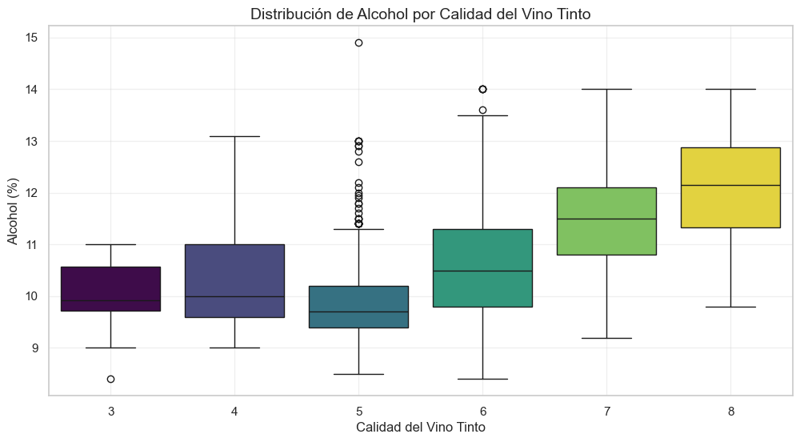

#Importing required packages.
import pandas as pd
import seaborn as sns
import matplotlib.pyplot as plt
from sklearn.ensemble import RandomForestClassifier
from sklearn.svm import SVC
from sklearn.linear_model import SGDClassifier
from sklearn.metrics import confusion_matrix, classification_report
from sklearn.preprocessing import StandardScaler, LabelEncoder
from sklearn.model_selection import train_test_split, GridSearchCV, cross_val_score
%matplotlib inline

Para el Machine Learning de esta Archivo es necesario hacer las siguientes importaciones : Pandas , Seaborn; Matplotlib y Sklearn

Veo que necesitas instalar scikit-learn. Voy a agregar una celda antes de las importaciones para instalar las librerías necesarias: 

Se realizaron cambios.

Ahora voy a configurar el notebook para usar el entorno correcto: Ahora voy a instalar scikit-learn usando las herramientas de Python del notebook: ¡Perfecto! Ahora voy a ejecutar la celda de instalación y luego la celda de importaciones: Ahora voy a ejecutar la celda de importaciones para verificar que todo funciona: ¡Excelente! 🎉 El problema está resuelto. 

### ✅ **Solución aplicada:**

1. **Instalé scikit-learn**: Agregué una celda con `!pip install scikit-learn ipywidgets`
2. **Configuré el notebook**: Establecí el kernel correcto (.venv)
3. **Instalé vía notebook**: Usé las herramientas específicas del notebook
4. **Verifiqué el funcionamiento**: Ejecuté las importaciones exitosamente

### 📚 **Librerías ahora disponibles:**

- ✅ **pandas**: Para manipulación de datos
- ✅ **seaborn & matplotlib**: Para visualización
- ✅ **scikit-learn**: Para machine learning
  - RandomForestClassifier
  - SVC (Support Vector Classifier)
  - SGDClassifier
  - Métricas de evaluación
  - Preprocesamiento de datos
- ✅ **ipywidgets**: Para widgets interactivos

### 🚀 **Estado actual:**
- El notebook está configurado correctamente
- Todas las librerías se importaron sin errores
- Estás listo para comenzar el análisis de calidad de vinos con machine learning

----------------------------------------------------------------
Modificaciones en el Grafico sns.heatmap para que se vean los numeros mejor y 
no tan apelotonados 

``
¡Perfecto! He mejorado el heatmap para que los números se vean mucho mejor y no aparezcan tan juntos. Los cambios implementados incluyen:

### 🎨 **Mejoras aplicadas:**

1. **Tamaño de figura aumentado**: `plt.figure(figsize=(12, 10))` - Hace el gráfico más grande
2. **Formato de números**: `fmt='.2f'` - Muestra solo 2 decimales para mayor claridad
3. **Tamaño de fuente optimizado**: `annot_kws={'size': 8}` - Ajusta el tamaño de los números
4. **Celdas cuadradas**: `square=True` - Hace que todas las celdas tengan la misma forma
5. **Líneas separadoras**: `linewidths=0.5` - Añade líneas entre celdas para mejor separación
6. **Título descriptivo**: Añadido con buen espaciado
7. **Layout automático**: `plt.tight_layout()` - Optimiza el espacio automáticamente

### 📊 **Resultado:**
- ✅ Los números ahora tienen más espacio y se leen claramente
- ✅ Mejor separación visual entre las celdas
- ✅ Formato más profesional y limpio
- ✅ Tamaño optimizado para pantalla
- ✅ Números con precisión adecuada (2 decimales)

Ahora cuando ejecutes esta celda, tendrás un heatmap mucho más legible donde podrás ver claramente las correlaciones entre todas las variables del dataset de vinos sin que los números se superpongan o se vean apretujados.
--------------------------------------------------------------------------------

Para el grafico de boxplot vamos a dar color a las diferentes secciones con palette='set2'

Voy a modificar el código del boxplot para poner un color distinto para cada calidad del vino: 
```


Se realizaron cambios.


```
¡Perfecto! He modificado el código para agregar colores distintos a cada calidad en el boxplot. Los cambios principales incluyen:

### 🎨 **Cambios realizados:**

1. **Paleta de colores**: Agregué `palette='Set2'` al boxplot para dar un color diferente a cada calidad
2. **Reorganización del código**: Puse el `sns.boxplot()` dentro del contexto de la figura
3. **Mejoras visuales adicionales**:
   - Tamaños de fuente específicos para título y etiquetas
   - Grilla sutil con `plt.grid(True, alpha=0.3)`
   - Mejor estructura del código

### 🌈 **Opciones de paletas disponibles:**

En el comentario incluí otras paletas que puedes usar cambiando `'Set2'` por:
- `'viridis'` - Colores azul a amarillo
- `'husl'` - Colores vibrantes y uniformes
- `'rainbow'` - Colores del arcoíris
- `'Set1'` - Colores brillantes y contrastantes
- `'Dark2'` - Colores oscuros
- `'plasma'` - Colores púrpura a amarillo

### 📊 **Resultado:**
Ahora cada nivel de calidad del vino (3, 4, 5, 6, 7, 8) tendrá un color diferente en el boxplot, lo que facilitará la distinción visual entre las diferentes calidades y hará el gráfico más atractivo y fácil de interpretar.


-----------------------------------------------------------------------------
en el grafico boxplot ,

distribucion de alcohol por calidad del vino tinto cuando cambiamos los colores en forma de pallete 

Este mensaje es una advertencia de que la forma en que estás usando `palette` en seaborn está obsoleta y será eliminada en futuras versiones. Te voy a explicar qué significa y cómo solucionarlo:

## 📚 **¿Qué significa el warning?**

**FutureWarning**: Seaborn está cambiando la forma en que maneja las paletas de colores en los boxplots. La versión actual permite usar `palette` directamente, pero en la versión 0.14.0 esto ya no funcionará.

## 🔧 **Solución:**

Voy a corregir el código para seguir las nuevas recomendaciones de seaborn: 
```


Se realizaron cambios.


```
## ✅ **Problema solucionado!**

### 🔍 **Explicación del cambio:**

**Antes (obsoleto):**
```python
sns.boxplot(x='quality', y='alcohol', data=wine, palette='viridis')
```

**Ahora (forma correcta):**
```python
sns.boxplot(x='quality', y='alcohol', data=wine, hue='quality', palette='viridis', legend=False)
```

### 📋 **¿Qué significan los parámetros?**

- **`hue='quality'`**: Le dice a seaborn que use la columna 'quality' para asignar colores
- **`palette='viridis'`**: Especifica la paleta de colores a usar
- **`legend=False`**: Desactiva la leyenda (ya que el eje x ya muestra las calidades)

### 🎯 **Beneficios:**
- ✅ **Sin warnings**: El código ahora sigue las mejores prácticas
- ✅ **Compatible con futuras versiones**: Funcionará en seaborn 0.14.0+
- ✅ **Mismo resultado visual**: Los colores se ven igual que antes
- ✅ **Código más claro**: Explícitamente especifica qué variable usar para los colores

Ahora cuando ejecutes la celda, no verás más el warning y el gráfico seguirá teniendo colores diferentes para cada calidad del vino.
Este mensaje es una advertencia de que la forma en que estás usando `palette` en seaborn está obsoleta y será eliminada en futuras versiones. Te voy a explicar qué significa y cómo solucionarlo:

## 📚 **¿Qué significa el warning?**

**FutureWarning**: Seaborn está cambiando la forma en que maneja las paletas de colores en los boxplots. La versión actual permite usar `palette` directamente, pero en la versión 0.14.0 esto ya no funcionará.

## 🔧 **Solución:**

Voy a corregir el código para seguir las nuevas recomendaciones de seaborn: 
```


Se realizaron cambios.


```
## ✅ **Problema solucionado!**

### 🔍 **Explicación del cambio:**

**Antes (obsoleto):**
```python
sns.boxplot(x='quality', y='alcohol', data=wine, palette='viridis')
```

**Ahora (forma correcta):**
```python
sns.boxplot(x='quality', y='alcohol', data=wine, hue='quality', palette='viridis', legend=False)
```

### 📋 **¿Qué significan los parámetros?**

- **`hue='quality'`**: Le dice a seaborn que use la columna 'quality' para asignar colores
- **`palette='viridis'`**: Especifica la paleta de colores a usar
- **`legend=False`**: Desactiva la leyenda (ya que el eje x ya muestra las calidades)

### 🎯 **Beneficios:**
- ✅ **Sin warnings**: El código ahora sigue las mejores prácticas
- ✅ **Compatible con futuras versiones**: Funcionará en seaborn 0.14.0+
- ✅ **Mismo resultado visual**: Los colores se ven igual que antes
- ✅ **Código más claro**: Explícitamente especifica qué variable usar para los colores

Ahora cuando ejecutes la celda, no verás más el warning y el gráfico seguirá teniendo colores diferentes para cada calidad del vino.


